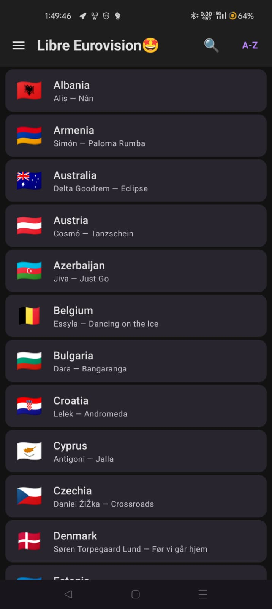
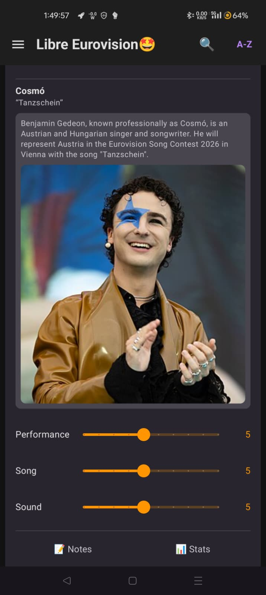
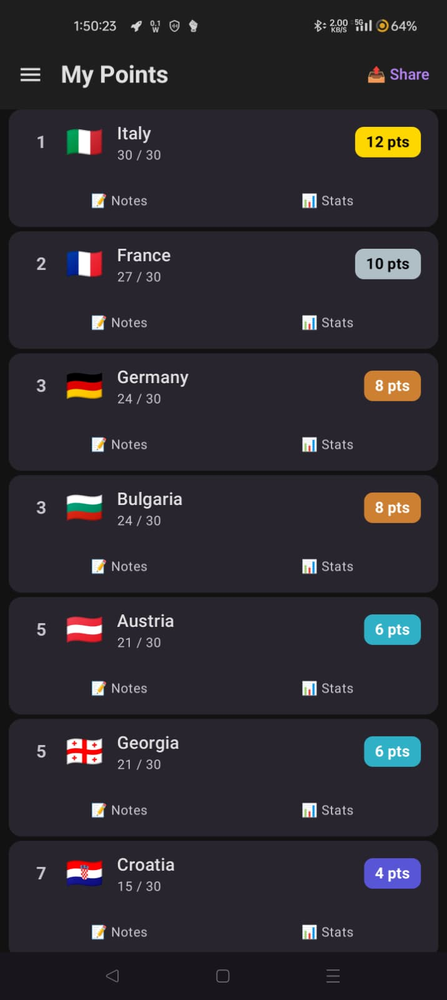
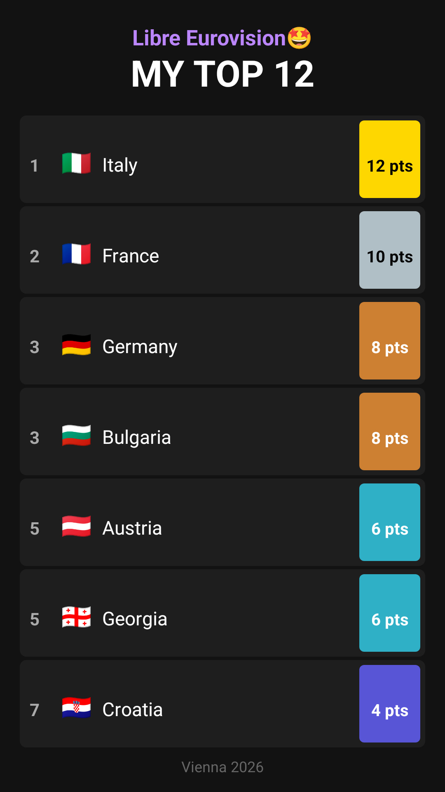

# 🎤 Libre Eurovision

> Score every act. No account. No tracking. Just Eurovision.

Libre Eurovision is a free, open source companion app for the Eurovision Song Contest. Built for fans who want the full scoring experience without handing over their data to anyone.

---

## 📱 Screenshots

<p align="center">
  
  
  
  
</p>

---

## ✨ Features

- **Live scoring** — rate each country on performance, song, and sound as they happen
- **Real Eurovision points** — your top 12 automatically get douze points, dix points, and so on
- **Artist bios** — Wikipedia info and photos pulled for each competing act, cached for offline use
- **Historical stats** — every country's Eurovision record at a glance
- **Notes** — jot thoughts on each act as the night unfolds
- **Share your top 12** — export as a portrait image for Stories or square for feeds
- **Backup & restore** — save your scores as a JSON file, restore on any device
- **Onboarding wizard** — set your watching country to get the right televote number

---

## 🔒 Privacy promise

| Official Eurovision app | Libre Eurovision |
|---|---|
| Requires account & email | No account. No email. Ever. |
| Shares data with third parties | Zero third-party sharing |
| Collects personal info & app activity | Collects nothing about you |
| ~20 device permissions | Only storage (for your scores) |
| Your data lives on their servers | Everything stays on your phone |

No ads. No analytics. No trackers. You can read every line of code.

---

## 📲 Install

### Direct download (easiest)
Grab the latest APK from the [Releases](../../releases) page and install it on any Android device running Android 8.0 (API 26) or higher.

> You may need to enable **Install from unknown sources** in your Android settings.

### F-Droid
Submission in progress. Watch this space.

---

## 🛠️ Build from source

```bash
git clone https://github.com/yourusername/LibreEurovision.git
```

Open the project in Android Studio, let Gradle sync, then hit Run.

Requires Android Studio Hedgehog or newer.

---

## 🗳️ Updating for each year's contest

Open `app/src/main/java/com/eurovisionfoss/app/data/Countries.kt` and update:
- `runningOrder` — after the official draw
- `artist` and `song` — once EBU confirms entries
- `competing2026` → rename field for the new year

Wikipedia bios will auto-fetch using the artist name once updated.

---

## 📜 License

GPL v3 — see [LICENSE](LICENSE).

Use it, modify it, share it. You cannot make it proprietary.

---

## 🙏 Credits

- Eurovision history data sourced from public fan datasets
- Artist bios via the [Wikipedia REST API](https://en.wikipedia.org/api/rest_v1/)
- Built with Jetpack Compose, Room, OkHttp, and Coil
- Inspired by the belief that enjoying Eurovision shouldn't cost you your privacy

---

## ☕ Support

If you enjoy Libre Eurovision, you can support development on Ko-fi:

[](https://ko-fi.com/michael_jay)

---
*United by music. Freed from tracking.*
